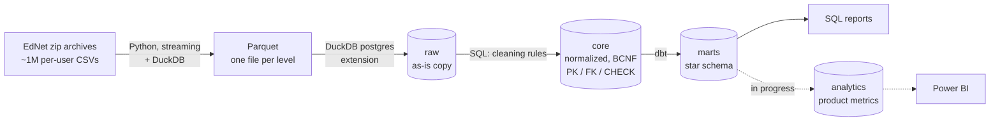

# EdNet Learner Activity DWH

A PostgreSQL + dbt data warehouse built on **226 million real learning events** from Santa, a Korean TOEIC-prep app ([EdNet dataset](https://github.com/riiid/ednet)). It covers the whole path from raw zip archives to tested analytical marts: profiling, a normalized core model, a star schema, access control, verified backups and measured performance.

**Why it exists.** Online learning platforms lose most of their users early: in this data only **12 %** of learners answer anything in their second week. To act on that, a product team needs fast, trustworthy answers to questions like *who drops off, when, and what the ones who stay do differently*. This repository is the foundation for those answers; the product analytics layer on top of it is in progress (see [Roadmap](#roadmap)).

## Highlights

| | Result |
|---|---|
| Volume | 95.3M answers (KT1) + 131.4M app events (KT4), 784,309 learners, 2017–2019 |
| Report latency | weekly retention report: **30.1 s → 0.86 s** on marts vs the normalized core |
| Targeted index | learner history lookup: **2.8 s → 0.4 ms** (composite B-tree on 131M rows) |
| Mart rebuild | 6 dbt models + 18 data tests in **6.6 min**, all passing |
| Backup & restore | `pg_dump` of core + marts in 103 s; restore **verified** on all 22 tables (~27 min) |
| Independent check | retention report recomputed from raw Parquet in DuckDB: identical in **27 of 27 weeks** |

## Architecture



| Layer | Purpose | Why it is a separate layer |
|---|---|---|
| **raw** | exact typed copy of the source, duplicates included | any transformation can be re-run without re-reading 2.4 GB of archives |
| **core** | normalized model (16 tables) with all keys and constraints | one fact in one place; constraints reject bad data at load time |
| **marts** | star schema for reporting (6 tables) | reports read pre-aggregated data instead of scanning 95M rows |

## Data model

**core** is in Boyce–Codd normal form. Normalization decisions came from profiling, not from theory alone:

- **Solving sessions are their own table.** In the flat source, session start time and elapsed time repeat on every answer row — and in **462,550 sessions** the copies disagree (an update anomaly). `core.solving_session` stores them once.
- **Tags are a junction table.** The source keeps them as a `"1;2;179"` string, which violates 1NF and cannot be joined or indexed.
- **One content supertype.** The event log points to six kinds of items (questions, bundles, explanations, lectures, payment items, coupons). `core.content_item` gives one real foreign key instead of an unchecked polymorphic text field.
- **Keys are added after the bulk load.** Checking ~300M rows in one pass per constraint is faster than row-by-row checks during insert.

**marts** (dbt, materialized as tables):

| Model | Grain | Rows |
|---|---|---|
| `fct_answer` | one answer | 94.6M |
| `fct_user_day` | learner × calendar day | 3.5M |
| `agg_part_day` | TOEIC part × day | 6,713 |
| `dim_user` | learner (cohort, totals) | 791,871 |
| `dim_question` | question | 13,169 |
| `dim_date` | day | 1,005 |

Tests cover uniqueness and not-null keys, referential integrity between facts and dimensions, accepted values, the grain of `fct_user_day`, and reconciliation of `fct_answer` with core.

## Data quality

Found during profiling (DuckDB over Parquet) and handled in the load, with every rule documented in `sql/load/10_core.sql`:

| Issue | Scale | Handling |
|---|---|---|
| Exact duplicate events | ~461K in KT4 | dropped in core, kept in raw |
| Repeated answers to the same question within a session | ~0.7M | latest answer kept |
| `-1` used instead of NULL in reference data and event items | all reference tables | converted to NULL |
| Session time inconsistent across rows of one session | 462,550 sessions | earliest time; non-positive elapsed time → NULL |
| Users present in KT4 but missing from KT1 | 7,562 | `app_user` built from the union of both logs |

The constraints paid off: a foreign key stopped the first full load when 722 playback events carried `'-1'` as an item while the cleaning rule checked for `'-'`. The bug was caught at load time, before it reached any report.

## Performance

Median of three warm runs, `EXPLAIN (ANALYZE, BUFFERS)`, PostgreSQL 17.6 on a single workstation (`pipeline/04_perf.py`).

| Report | core | marts | Speed-up |
|---|---:|---:|---:|
| Weekly active learners and accuracy | 5,502 ms | 479 ms | 11× |
| Retention by week since first answer | 30,101 ms | 863 ms | 35× |
| Answers and accuracy by TOEIC part | 2,496 ms | 0.8 ms | ~3,100× |
| Inactive learners above an activity threshold | 3,167 ms | 44 ms | 72× |

The speed-up comes from reading less data, not from server tuning: `fct_user_day` is 27× smaller than `fct_answer`, and `agg_part_day` has 6,713 rows.

A single learner's event history scanned 131M rows in 2.8 s; a composite index on `(user_id, occurred_at)` brings it to 0.41 ms, at the cost of 3.9 GB and 138 s to build.

## Security and operations

- **Least-privilege roles.** Group roles carry the privileges, login roles only join groups: `loader` writes raw/core, `transformer` reads core and builds marts, `analyst` reads marts only, with a 60 s statement timeout. Denied actions are tested in `sql/admin/check_access.sql`.
- **No secrets in the repo.** Passwords come from environment variables (`.env`, git-ignored; template in `.env.example`).
- **Backups that are proven to restore.** core and marts are dumped in directory format with 8 parallel jobs and zstd compression; the restore goes to a separate database and is checked by row counts on all 22 tables plus an identical retention report. raw is deliberately not backed up: it is rebuilt from the source archives.

## Repository structure

```
pipeline/    01 archives → Parquet · 02 Parquet → raw → core · 04 benchmarks · 05 backup & verified restore
sql/
  ddl/       raw schema, core tables, keys
  load/      raw → core cleaning and load
  admin/     roles and access check
  reports/   four analytical reports (parameterized psql scripts)
  demo/      integrity-constraint and index-effect demos
dbt/         star-schema marts and data tests
profiling/   DuckDB profiling, functional-dependency checks, independent retention check
```

## How to run

**Requirements:** PostgreSQL 17, Python 3.11 with `duckdb`, dbt-core 1.12 with dbt-postgres, ~60 GB free disk (about 100 GB to also run the restore test).

1. Download KT1, KT4 and the contents archive from [riiid/ednet](https://github.com/riiid/ednet) into a data folder (`C:/ednet` by default).
2. Copy `.env.example` to `.env` and set the passwords.
3. Convert the archives to Parquet:
   ```bash
   python pipeline/01_zip_to_parquet.py C:/ednet
   ```
4. Create the `ednet` database, then load raw → core with keys (~40 min):
   ```bash
   python pipeline/02_load.py C:/ednet
   ```
5. Create the roles (passwords from `.env`):
   ```bash
   psql -d ednet -v etl_pw=... -v dbt_pw=... -v analyst_pw=... -f sql/admin/roles.sql
   ```
6. Build and test the marts (~7 min):
   ```bash
   cd dbt
   dbt build --profiles-dir .
   ```
7. Run a report as the analyst:
   ```bash
   psql -U analyst_user -d ednet -f sql/reports/f2_retention.sql
   ```

## Roadmap

The warehouse answers *what happened*. The next layer answers *why, and what to do about it*. Early numbers from the full event log already shape it: **74 %** of learners are active on a single day only, **8 %** ever pay, and **59 %** of payers pay before their first practice session — two different paths to revenue that a single funnel would blur.

- [ ] Metric definitions: North Star (weekly active learners), metric tree, metric dictionary
- [ ] `analytics` schema in dbt: learner lifecycle and weekly activity models (Asia/Seoul calendar days)
- [ ] Activation and monetization funnel, split by payment path
- [ ] Cohort retention and the first-week behaviour that predicts staying
- [ ] Power BI dashboard (`.pbip`, version-controlled)
- [ ] Effect of reviewing explanations after a wrong answer (quasi-experiment) and sizing a future A/B test
- [ ] Content health: questions with abnormal difficulty or timing
- [ ] Churn-risk model on first-week features
- [ ] CI: `dbt parse` and SQL linting on every push

## Dataset and license

Code: [MIT](LICENSE). Data: EdNet is published by Riiid under [CC BY-NC 4.0](https://creativecommons.org/licenses/by-nc/4.0/) and is not included in this repository.

> Choi Y., Lee Y., Shin D., et al. *EdNet: A Large-Scale Hierarchical Dataset in Education.* AIED 2020, LNAI 12164, pp. 69–73. https://doi.org/10.1007/978-3-030-52240-7_13
